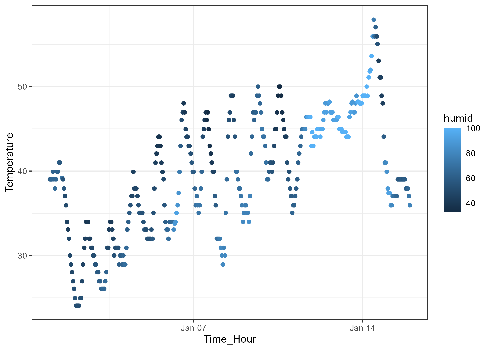

p8105_hw1_ps3395
================
PENG
2023-09-17

## Problem 1

### Preparatory work

#### library packages

``` r
#library the packages
library(moderndive)
library(ggplot2)
library(tidyverse)
```

#### Load the data

``` r
#loading dataset
data("early_january_weather")
tail(early_january_weather, 3)
```

    ## # A tibble: 3 × 15
    ##   origin  year month   day  hour  temp  dewp humid wind_dir wind_speed wind_gust
    ##   <chr>  <int> <int> <int> <int> <dbl> <dbl> <dbl>    <dbl>      <dbl>     <dbl>
    ## 1 EWR     2013     1    15    21  37.9  27.0  64.3       30       5.75        NA
    ## 2 EWR     2013     1    15    22  37.0  28.9  72.2       20       8.06        NA
    ## 3 EWR     2013     1    15    23  36.0  30.0  78.8       20       9.21        NA
    ## # ℹ 4 more variables: precip <dbl>, pressure <dbl>, visib <dbl>,
    ## #   time_hour <dttm>

#### Dataset description

Above table shows the last 3 rows of the dataset
*‘early_january_weather’* which represent the hourly meterological data
for EWR for January 2013 with 15 columns and 358 rows.

The *‘early_january_weather’* dataset includes 15 variables such as:

- `origin`: The Weather station, in this dataset, it only contains
  `EWR`.
- `year`, `month`, `day`, `hour`: The recording time.
- `temp`: The temperature in F, and the average temperature is 39.58
  (round to 2 decimal)

#### Scatterplot

Plot a scatterplot of `temp` and `time_hour`, colored by `humid`
variable using `ggplot()`.

``` r
#plot scatter_plot for temp and time_hour
scatter_plot <- 
  ggplot(early_january_weather, aes(time_hour, temp, color = humid)) +
  geom_point()+
  xlab("Time_Hour")+
  ylab("Temperature")+
  theme_bw()
```

#### Scatter plot description

From scatter plot of temperature and time hour shows below, it is
noticeable that although there are significant and persistent
fluctuations in the temperature measured by weather station in January,
the overall trend for temperature is gradually increasing over the time,
and peaking after January 14 which reaches 57.92 degrees Fahrenheit.
Meanwhile, the relative humidity is relatively high from about January
12 to 14, which is shown as a light blue dots in Figure 1.

saving plot

``` r
#saving the plot to png.
ggsave("scatterplot.png",scatter_plot)
```

<div class="figure" style="text-align: center">


<p class="caption">
Figure 1
</p>

</div>

## Problem 2

### Creating dataframe

Creating a data frame comprised of numeric, logical, character and
factor variables.

``` r
#creat the data frame
sample_df <- tibble(
  num_random = rnorm(10, mean = 0, sd = 1),
  log_ver = num_random > 0,
  cha_ver = c("A","B","C","D","E","F","G","H","I","J"),
  factor_ver = factor(c("large","large","large","large","mid","mid","mid","small","small","small"),levels = c("large", "mid", "small"))
)
```

#### Taking the mean of each variable in dataframe using `mean()` function.

`mean()` function works with numeric and logical arguments, which are
`num_random` and `log_ver` in `sample_df`.

``` r
#calculate the mean
mean_num = mean(pull(sample_df,num_random))
mean_log = mean(pull(sample_df,log_ver))
mean_num
```

    ## [1] -0.2415769

``` r
mean_log
```

    ## [1] 0.3

`mean()` function does not works with arguments that are not numeric or
logical and will return NA as result. Such as `cha_ver` and `factor_ver`
these two variables in the dataframe.

``` r
#calculate the mean
mean_cha = mean(pull(sample_df,cha_ver))
```

    ## Warning in mean.default(pull(sample_df, cha_ver)): argument is not numeric or
    ## logical: returning NA

``` r
mean_factor = mean(pull(sample_df,factor_ver))
```

    ## Warning in mean.default(pull(sample_df, factor_ver)): argument is not numeric
    ## or logical: returning NA

``` r
mean_cha
```

    ## [1] NA

``` r
mean_factor
```

    ## [1] NA

#### Explicitly convert variables

Using `as.numeric` function to convert the logical, character, and
factor variables.

``` r
#convert variables to numeric
log_ver_N = as.numeric(pull(sample_df, log_ver))
cha_ver_N = as.numeric(pull(sample_df, cha_ver))
factor_ver_N = as.numeric(pull(sample_df, factor_ver))
```

After applying `as.numeric` function to convert the logical, character,
and factor variables, as logical variables are Boolean, it can be
convert to numeric values, which *“1”* represent *“TRUE”* and *“0”*
represent *“FALSE”*. This can also explain that logical variables can
apply `mean()` function.

At the same time, although the `mean()` function consider the character
in `factor_ver` column and can not calculate the mean of the vectors,
the levels in factor variables can also represent the character vectors.
Additionally, levels can be represented by different numeric variables,
this may explain why the factor variable can not be averaged, but can be
converted to a numeric variable.

However, the character variables do not have levels, and can not be
converted to numeric variables. In this case, `as.numeric` function will
return NAs.
